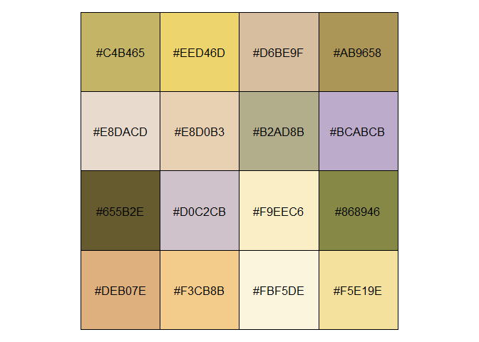
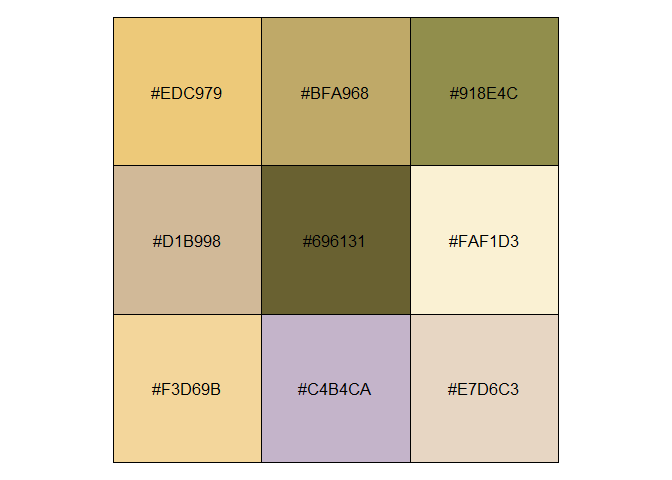
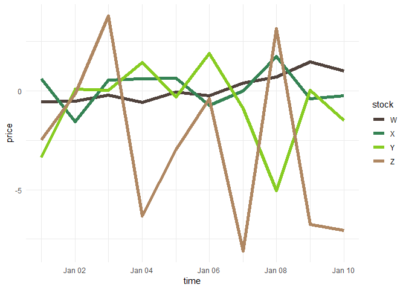
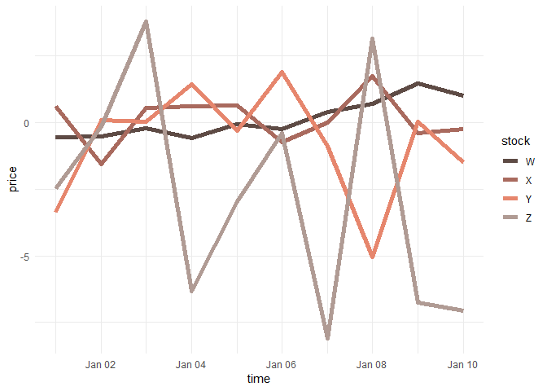
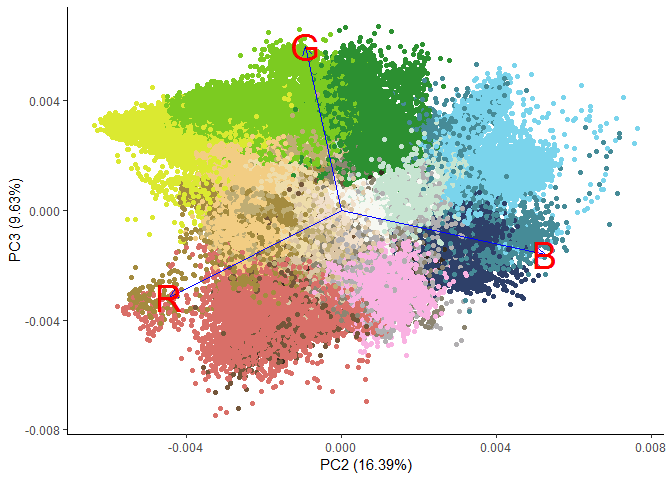

Rick and Morty Palettes
=======================

This was just a fun morning exercise. Let's mix multiple images to make
a palette of their principal colors using k-means. We'll also use the
totally awesome list-columns concept to put each image's jpeg data into
a data frame of lists that we can `map` to a function that turns the
jpeg data into a list of palette colors in a new data frame.

This more-or-less copies
<http://www.milanor.net/blog/build-color-palette-from-image-with-paletter/>
with the added twist of using multiple images before creating the
palette. We'll also get into the weeds a bit more with dissecting the
images. I wanted to see if some cartoon show palettes using this method
matched those in the
[`ggsci`](https://cran.r-project.org/web/packages/ggsci/vignettes/ggsci.html)
package. Did the authors use the algorithmic approach I will use here?
Will my approach look any better? Don't know. I decided to use "Rick and
Morty" because my kids like it. I would certainly never watch such
drivel. I'm a scientist.

For the record, the one pop culture derived palette I really like is the
[Wes Anderson palette](https://github.com/karthik/wesanderson) and on
CRAN. These are presumably lovingly curated and created, not like the
ones created by the stupid robot I use here.

The drawback to using K-means to create palettes from images is that
it's likely that *none* of the colors created are actually in the image.
They just represent the mathematical centers of the clusters of colors.

Load libraries.

    library(tidyverse)
    library(jpeg) #import images
    library(scales) #just for for the show_col() function
    library(ggsci) #to compare my palettes to its palettes
    library(ggfortify) #to support kmeans plots
    library(gridExtra) #multiple plots on a page

Load mulitple images. They are all Google image search thumbnails so the
size is the same. This matters since we are combining images. A larger
image would have a disproportional weight in our analysis.

I first thought that, since I am combining multiple images to get one
palette, I needed to tile the images then process. No. We just care
about the pixel color values so it really doesn't matter what position
they are in. The most efficient approach is to just chain all the RGB
values together. Duh. Still we want to do some work with the individual
images so let's label them.

    rm_list<-list()
    for (n in 1:6){
      img<-jpeg::readJPEG(paste0("img/rm",n,".jpg"))
      R<-as.vector(img[,,1])
      G<-as.vector(img[,,2])
      B<-as.vector(img[,,3])
      rm_list<-bind_rows(data_frame(img=n,R,G,B),rm_list) %>% 
        arrange(img)
    }

    rm_list <- left_join(rm_list,
                         data_frame(
                         img = c(1, 2, 3, 4, 5, 6),
                         name = c("Schwifty","Portal","Cable",
                         "Family", "Outdoor", "Wedding")
                         ))

Show Me What You Got
====================

I chose the images from Google image search to be representative of
varying but typical scenes.

 Cable

 Family

 Wedding

 Outdoor

 Portal

 Schwifty

For fun let's do some density plots of the color values.

    #make data tidy first
    rm_tidy <- rm_list %>% gather("color","level",-img,-name)
    ggplot(rm_tidy,aes(x=level,fill=color))+
      geom_density(alpha=0.7) + 
      scale_fill_manual(values=c("blue","green","red")) + 
      theme_void()

We can see some evidence of bimodality, a preference for very bright and
very dark hues. Red is more often cranked to the max, while blue is much
more evenly distributed. Perhaps that is typical of the limited palette
of cartoons or just a function of the small number of frames I chose.

    ggplot(rm_tidy,aes(x=level,fill=color))+
      geom_density(alpha=0.7) + 
      scale_fill_manual(values=c("blue","green","red")) + 
      facet_wrap(~name)+
      theme_void()

It's interesting to compare "Cable" with "Family." Both images share the
same backdrop but "Family" is much darker.

Make the Palettes
=================

When I was a kid with watercolors I wanted to come up with a name for
the filthy color that resulted when I mixed all the colors together. I
called it (trigger warning) "Hitler" (but, really, brown). What is the
color that results when we average all the RGB values? What named R
colors resemble it? It looks to me like it's between "cornsilk4"" and
"darkkhaki.""

    blend_color<-rm_list %>% 
      summarise(R=mean(R),G=mean(G),B=mean(B)) %>% 
      rgb()

    show_col(c("cornsilk4",blend_color,"darkkhaki"))

Let's call it "desertkhaki" which, hopefully, is not a trigger word.

Now, for the fun part. In the Wes Anderson palette set, each movie get's
a different palette. Let's make palettes for each of the images, which I
chose for their distinctiveness.

For me, the good thing about open source is that I can stand on the
shoulders of giants in the community. R also makes very muscular
analysis trivally simple. On the other hand, it makes "script kiddies"
like me potentially dangerous. I can only describe k-means in the most
general terms but can run it in a snap.

    num_colors = 16
    pal_schwifty <- rm_list %>% 
      filter(name=="Schwifty") %>% 
      select(R,G,B) %>% 
      kmeans(centers = num_colors, iter.max = 30) %>% 
      .$centers %>% 
      rgb()

    show_col(pal_schwifty)

For data plotting the separation between some of these colors is too
small. I think 9 colors will suffice.

    num_colors = 9
    pal_schwifty <- rm_list %>% 
      filter(name=="Schwifty") %>% 
      select(R,G,B) %>% 
      kmeans(centers = num_colors, iter.max = 30) %>% 
      .$centers %>% 
      as.tibble() %>% 
      {.}

    show_col(rgb(pal_schwifty))

For plotting purposes I would like use these colors in order of
intensity. Sorting colors is a [topic in
itself](http://www.alanzucconi.com/2015/09/30/colour-sorting/) but here
we'll do it quick and simple.

    pal_schwifty %>% 
      mutate(saturation=rowSums(.[1:3])) %>% 
      arrange(saturation) %>% 
      rgb() %>% 
      show_col()

That's about right. Let's put it all together. Go through all the images
to create a series of palettes.

    #function to turn a table of RGB values to an ordered list of colors
    gen_pal <- function(rgb_table) {
      num_colors = 9
      pal <- rgb_table %>%
      select(R, G, B) %>%
      kmeans(centers = num_colors, iter.max = 30) %>%
      .$centers %>%
      as.tibble() %>%
      mutate(saturation = rowSums(.[1:3])) %>%
      arrange(saturation) %>%
      rgb()
      return(pal)
    }

    #now make list columns, which are totally awesome, for each palette
    palette_rick<-rm_list %>% 
      group_by(name) %>% 
      select(-img) %>% 
      nest(.key="rgb") %>% 
      transmute(name=name,pal= map(rgb,gen_pal))
    palette_rick

    ## # A tibble: 6 x 2
    ##   name     pal      
    ##   <chr>    <list>   
    ## 1 Schwifty <chr [9]>
    ## 2 Portal   <chr [9]>
    ## 3 Cable    <chr [9]>
    ## 4 Family   <chr [9]>
    ## 5 Outdoor  <chr [9]>
    ## 6 Wedding  <chr [9]>

    #a function to extract the individual palettes, given a name.

    extract_pal<-function(palette_list,pal_name){
      pal<-palette_list %>% filter(name==pal_name) %>% 
        select(pal) %>% 
        unlist() %>% 
        as.vector()
      return(pal)
    }

    plot_one<-function(pal_name){
      tmp <- palette_rick %>% unnest() %>% filter(name==pal_name)
      g<- ggplot(tmp,aes(pal,fill=pal)) + geom_bar() + 
      scale_fill_manual(values=tmp$pal,guide=F) +
      theme_void()+ggtitle(pal_name)
      return (g)
      
    }

    lapply(palette_rick$name,plot_one) %>% 
      grid.arrange(grobs=.)

Finally, let's do what we said we'd do at the beginning, put all these
images together and add it to our list column of palettes.

    multi_img_pal <- gen_pal(rm_list)
    palette_rick<-data_frame(name="all",pal=list(multi_img_pal)) %>% bind_rows(palette_rick)
    show_col(multi_img_pal)

Not too bad. I'm glad something resembling Rick's hair makes it into the
list. Compare it to the ggsci package Rick and Morty palette. Here we
see the weaknesses of an algorithmic approach. ggsci is more interesting
since it has more color diversity and vividness. I assume they were hand
selected. You can see Rick's hair and Morty's shirt color.

    show_col(ggsci::pal_rickandmorty()(9))

Since the (rather flimsy) point of this excercise is to make palettes
for data graphics, let's make some plots.

    #use the example in help for dplyr::gather
    stocks <- data.frame(
      time = as.Date('2009-01-01') + 0:9,
      W = rnorm(10, 0, 1),
      X = rnorm(10, 0, 1),
      Y = rnorm(10, 0, 2),
      Z = rnorm(10, 0, 4)
    )
    stocksm <- stocks %>% gather(stock, price, -time)

    ggplot(stocksm,aes(time,price,color=stock))+geom_line(size=2)+
      scale_color_manual(values = multi_img_pal) + theme_minimal()

    ggplot(stocksm,aes(time,price,color=stock))+geom_line(size=2) +
      theme_minimal() +
      scale_color_manual(values = extract_pal(palette_rick,"Wedding"))

Arguably, the perceptual differnces among the colors are less than
ideal, even if the colors are pleasing. We might take the additional
step of hand-selecting colors from a larger generated palette that are
more suitable for plots.

One more thing...
=================

Back to the k-means analysis. When we created these palettes we were
really assigning colors to the centers of the clusters of near neigbors
in the a 2D space. This is a form of principal components analysis
(PCA). Let's visualize those clusters. The `ggplot::autoplot()` function
makes this trivally easy. While we are at it, let's crank up the number
of colors to 20.

    num_colors = 20
    #assign each pixel to a cluster
    km <-  rm_list[c("R","G","B")] %>% kmeans(centers = num_colors, iter.max = 30)

    rm_list <- rm_list %>% mutate(cluster=as.factor(km$cluster))
    autoplot(prcomp(rm_list[c("R","G","B")]), x=1,y=2,data = rm_list, colour = "cluster",
             loadings = TRUE, loadings.colour = 'blue',
             loadings.label = TRUE, loadings.label.size = 10) +
      scale_color_manual(values=rgb(km$centers),guide=FALSE)+
      theme_classic()

 This is
every pixel colored by it's cluster assignment and plotted. It's clear
that the x-dimension, which happens to explain 74% of the color
variance, is luminosity, with darker shades on the right. The other
dimension seems to be related to hue.

We can make it clear by plotting the second and third principal
component.

    rm_list <- rm_list %>% mutate(cluster=as.factor(km$cluster))
    autoplot(prcomp(rm_list[c("R","G","B")]), x=2,y=3,data = rm_list, colour = "cluster",
             loadings = TRUE, loadings.colour = 'blue',
             loadings.label = TRUE, loadings.label.size = 10) +
      scale_color_manual(values=rgb(km$centers),guide=F)+
      theme_classic()

Now it's quite clear that the second and third principal components map
to the color space even though this explains only about 25% of the
variation in the data.

\`\`\`
